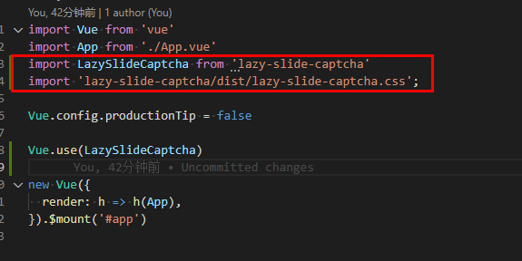

# LazySlideCaptcha前端组件使用

### 安装
```
npm install lazy-slide-captcha
```

### 项目引入


```
import LazySlideCaptcha from 'lazy-slide-captcha'
import 'lazy-slide-captcha/dist/lazy-slide-captcha.css';

Vue.use(LazySlideCaptcha);
```

### 页面使用
```
<template>
  <div class="hello">
    <lazy-slide-captcha
      ref="captcha"
      :width="width"
      :height="height"
      :show-refresh="true"
      :fail-tip="failTip"
      :success-tip="successTip"
      @finish="handleFinish"
      @refresh="generate"
    >
    </lazy-slide-captcha>
  </div>
</template>

<script>
import axios from 'axios';

export default {
  name: 'HelloWorld',
  props: {
    msg: String
  },
  data () {
    return {
      requestId: undefined,
      failTip: '',
      successTip: '',
      // width，height保持与552 * 344同比例即可
      width: 340,
      height: 212
    }
  },
  mounted () {
    this.generate()
  },
  methods: {
    generate () {
      // 改变内部状态，标识生成请求开始
      this.$refs.captcha.startRequestGenerate()

      axios.get('https://localhost:7179/api/captcha/gen')
        .then((response) => {
          this.requestId = response.data.id
          // 改变内部状态，标识生成请求结束，同时设定background，slider图像
          this.$refs.captcha.endRequestGenerate(response.data.backgroundImage, response.data.sliderImage)
        })
        .catch((error) => {
          console.log(error);
          // 标识生成请求结束
          this.$refs.captcha.endRequestGenerate(null, null)
        });
    },
    handleFinish (data) {
      // 改变内部状态，标识验证请求开始
      this.$refs.captcha.startRequestVerify()

      axios.post(`https://localhost:7179/api/captcha/check?id=${this.requestId}`, data)
        .then((response) => {
          let success = response.data.result === 0
          // 验证失败时显示信息
          this.failTip = response.data.result == 1 ? '验证未通过，拖动滑块将悬浮图像正确合并' : '验证超时, 请重新操作'
          // 验证通过时显示信息
          this.successTip = '验证通过，超过80%用户'
          // 改变内部状态，标识验证请求结束，同时设定是否成功状态
          this.$refs.captcha.endRequestVerify(success)

          if (!success) {
            setTimeout(() => {
              this.generate()
            }, 1000)
          }
        })
        .catch((error) => {
          console.log(error);
          this.failTip = '服务异常，请稍后重试'
          // 标识验证请求结束
          this.$refs.captcha.endRequestVerify(false)
        });
    }
  }
}
</script>

<!-- Add "scoped" attribute to limit CSS to this component only -->
<style scoped>
</style>

```

