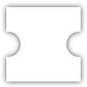
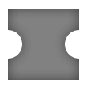
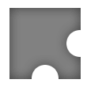

# LazySlideCaptcha

#### 介绍
LazySlideCaptcha是基于.Net Standard 2.1的滑动验证码模块。项目同时提供一个基于vue2的演示[前端组件](https://gitee.com/pojianbing/lazy-slide-captcha/tree/master/Components/vue2)和[背景图裁剪工具](http://www.sunseeyou.com/cropper/index.html)。       
**[【码云地址】](https://gitee.com/pojianbing/lazy-slide-captcha)|[【Github地址】](https://github.com/pojianbing/LazySlideCaptcha)**

 **图形验证码请移步[lazy-captcha](https://gitee.com/pojianbing/lazy-captcha)。** 

[ **在线体验点这里** ](http://www.sunseeyou.com/)

[    ](http://www.sunseeyou.com/)


#### 快速开始

1. 安装
- [Package Manager](https://www.nuget.org/packages/Lazy.SlideCaptcha.Core)

```powershell
Install-Package Lazy.SlideCaptcha.Core
```

- [.NET CLI](https://www.nuget.org/packages/Lazy.SlideCaptcha.Core)

```powershell
dotnet add package Lazy.SlideCaptcha.Core
```

2. 注册并配置服务
``` c#
builder.Services.AddDistributedMemoryCache();
builder.Services.AddSlideCaptcha(builder.Configuration);

// 如果使用redis分布式缓存
//builder.Services.AddStackExchangeRedisCache(options =>
//{
//    options.Configuration = builder.Configuration.GetConnectionString("RedisCache");
//    options.InstanceName = "captcha:";
//});
```
``` json
"SlideCaptcha": {
    "Backgrounds": [
      {
        "Type": "file",
        "Data": "wwwroot/images/background/1.jpg"
      },
      {
        "Type": "file",
        "Data": "wwwroot/images/background/2.jpg"
      }
    ]
  }
```
> 背景图片要求尺寸要求为 **_552 X 344_** , 快速开始可在 **_Demo_**  项目  **_wwwroot/images/background_**  下挑选。（仅用作演示，生产请自行制作。）也可以通过[裁剪工具](http://www.sunseeyou.com/cropper/index.html)制作，非常简单，上传图片，拖动范围后保存自动生成 _**552 X 344**_ 图片。

3. 接口定义
``` c#
[Route("api/[controller]")]
[ApiController]
public class CaptchaController : ControllerBase
{
    private readonly ICaptcha _captcha;

    public CaptchaController(ICaptcha captcha)
    {
        _captcha = captcha;
    }

    /// <summary>
    /// id
    /// </summary>
    /// <param name="id"></param>
    /// <returns></returns>
    [Route("gen")]
    [HttpGet]
    public CaptchaData Generate()
    {
        return _captcha.Generate();
    }

    /// <summary>
    /// id
    /// </summary>
    /// <param name="id"></param>
    /// <returns></returns>
    [Route("check")]
    [HttpPost]
    public ValidateResult Validate([FromQuery]string id, SlideTrack track)
    {
        return _captcha.Validate(id, track);
    }
}

```
至此后端Api服务已搭建完成。

4. 前端  
前端提供演示组件[lazy-slide-captcha](https://gitee.com/pojianbing/lazy-slide-captcha/tree/master/Components/vue2)，可通过npm安装。Demo项目为了演示方便直接采用script直接引入方式。


``` html
@{
    ViewData["Title"] = "滑动验证码";
}

<link rel="stylesheet" href="~/lib/lazy-slide-captcha/dist/lazy-slide-captcha.css" asp-append-version="true" />

<style>
    #app {
        display: flex;
        align-items: center;
        justify-content: center;
    }

    .panel {
        padding: 20px;
        box-shadow: inherit;
        border-radius: 6px;
        box-shadow: 0 0 4px 0 #999999;
        margin-top: 100px;
    }
</style>

<div id="app">
    <div class="panel">
        <lazy-slide-captcha ref="captcha" :width="width" :height="height" :show-refresh="true" :fail-tip="failTip" :success-tip="successTip" @@finish="handleFinish" @@refresh="generate"></lazy-slide-captcha>
    </div>
</div>


@section Scripts{
    <script src="~/lib/vue/vue.min.js"></script>
    <script src="~/lib/vue/axios.min.js"></script>
    <script src="~/lib/lazy-slide-captcha/dist/lazy-slide-captcha.umd.js"></script>

    <script>
        var app = new Vue({
             el: '#app',
             data(){
                return {
                    requestId: undefined,
                    failTip: '',
                    successTip: '',
                    // width，height保持与552 * 344同比例即可
                    width: 340,
                    height: 212
                }
             },
             mounted(){
                 this.generate()
             },
             methods:{
                 generate(){
                     // 改变内部状态，标识生成请求开始
                     this.$refs.captcha.startRequestGenerate()

                     axios.get('/api/captcha/gen')
                       .then((response) => {
                           this.requestId = response.data.id
                           // 改变内部状态，标识生成请求结束，同时设定background，slider图像
                           this.$refs.captcha.endRequestGenerate(response.data.backgroundImage, response.data.sliderImage)
                       })
                       .catch((error) => {
                           console.log(error);
                           // 标识生成请求结束
                           this.$refs.captcha.endRequestGenerate(null, null)
                       });
                 },
                 handleFinish(data){
                     // 改变内部状态，标识验证请求开始
                     this.$refs.captcha.startRequestVerify()

                     axios.post(`/api/captcha/check?id=${this.requestId}`, data)
                       .then((response) => {
                           let success = response.data.result === 0
                           // 验证失败时显示信息
                           this.failTip = response.data.result == 1 ? '验证未通过，拖动滑块将悬浮图像正确合并' : '验证超时, 请重新操作'
                           // 验证通过时显示信息
                           this.successTip = '验证通过，超过80%用户'
                           // 改变内部状态，标识验证请求结束，同时设定是否成功状态
                           this.$refs.captcha.endRequestVerify(success)

                           if(!success){
                                setTimeout(() => {
                                    this.generate()
                                }, 1000)
                           }
                       })
                       .catch((error) => {
                         console.log(error);
                         this.failTip = '服务异常，请稍后重试'
                         // 标识验证请求结束
                         this.$refs.captcha.endRequestVerify(false)
                       });
                 }
             }
        });
    </script>
}
```

#### 配置说明
支持配置文件和代码配置，同时配置则代码配置覆盖配置文件。
- 配置文件
``` c#
"SlideCaptcha": {
    "ExpirySeconds": 60, // 缓存过期时长
    "StoreageKeyPrefix": "", // 缓存前缀
    "Tolerant": 0.02, // 容错值(校验时用，缺口位置与实际滑动位置匹配容错范围)
    "Backgrounds": [ // 背景图配置
      {
        "Type": "file",
        "Data": "wwwroot/images/background/1.jpg"
      }
    ],
    // Templates不配置，则使用默认模板
    "Templates": [
      {
        "Slider": {
          "Type": "file",
          "Data": "wwwroot/images/template/1/slider.png"
        },
        "Hole": {
          "Type": "file",
          "Data": "wwwroot/images/template/1/hole.png"
        }
      }
    ]
  }
```

- 代码配置
``` c#
builder.Services.AddSlideCaptcha(builder.Configuration, options =>
{
    options.Tolerant = 0.02f;
    options.StoreageKeyPrefix = "slider-captcha";

    options.Backgrounds.Add(new Resource(FileResourceHandler.TYPE, @"wwwroot/images/background/1.jpg"));
    options.Templates.Add
    (
        TemplatePair.Create
        (
            new Resource(FileResourceHandler.TYPE, @"wwwroot/images/template/1/slider.png"),
            new Resource(FileResourceHandler.TYPE, @"wwwroot/images/template/1/hole.png")
        )
    );
});
```
#### 扩展
1. Template自定义  
 _**Template**_ 是指用于生成凹槽和拖块的图片，可通过Templates配置节点设置设置自定义Template。 默认五个 _**Template**_ （不要配置，已经包含在类库内部）如下：

|  slider                                            |  hole                                           |  slider                                            |  hole                                           |
|----------------------------------------------------|-------------------------------------------------|----------------------------------------------------|-------------------------------------------------|
|  | |  | |
|  | |  | |
|  | |

禁用默认 _**Template**_调用DisableDefaultTemplates即可:
``` c#
builder.Services.AddSlideCaptcha(builder.Configuration)
    .DisableDefaultTemplates();
```

2. Validator自定义
类库提供 _**SimpleValidator**_ ， _**BasicValidator**_ 两个实现。  
 _**SimpleValidator**_ 仅位置验证，_**BasicValidator**_除位置验证外，同时对轨迹做验证。_**BasicValidator**由于算法的原因，容易误判，因此类库默认用_**SimpleValidator**_ 做为默认 _**Validator**_ 。  
自定义 _**Validator**_ 继承 **_BaseValidator_** ， _**BaseValidator**_ 提供了基本的位置验证。   

举一个栗子：
``` c# 
public class CustomValidator: BaseValidator
{
    public override bool ValidateCore(SlideTrack slideTrack, CaptchaValidateData captchaValidateData)
    {
        // BaseValidator已做了基本滑块与凹槽的对齐验证，这里做其他验证

        return true;
    }
}
```

替换默认的Validator
``` c#
builder.Services.AddSlideCaptcha(builder.Configuration);
    .ReplaceValidator<CustomValidator>();
```

3. ResourceProvider自定义  
除了通过Options配置Background和Template外，你也可以通过自定义ResourceProvider的形式提供Background和Template。
```csharp
public class CustomResourceProvider : IResourceProvider
{
    public List<Resource> Backgrounds()
    {
        return Enumerable.Range(1, 10)
            .ToList()
            .Select(e => new Resource(Core.Resources.Handler.FileResourceHandler.TYPE, $"wwwroot/images/background/{e}.jpg"))
            .ToList();
    }
    
    // 这里返回自定义的Template
    public List<TemplatePair> Templates()
    {
        return new List<TemplatePair>();
    }
}
```

注册ResourceProvider
``` csharp
builder.Services.AddSlideCaptcha(builder.Configuration)
    .AddResourceProvider<CustomResourceProvider>();
```

4. 自定义ResourceHandler
```csharp
public class UrlResourceHandler : IResourceHandler
{
    public const string Type = "url";

    public bool CanHandle(string handlerType)
    {
        return handlerType == Type;
    }

    /// <summary>
    /// 这里仅演示，仍然从本地读取。实际需要通过Http读取
    /// </summary>
    /// <param name="resource"></param>
    /// <returns></returns>
    /// <exception cref="ArgumentNullException"></exception>
    public byte[] Handle(Resource resource)
    {
        if (resource == null) throw new ArgumentNullException(nameof(resource));
        return File.ReadAllBytes(resource.Data);
    }
}
```

注册ResourceHandler
```csharp
builder.Services.AddSlideCaptcha(builder.Configuration)
    .AddResourceHandler<UrlResourceHandler>();
```

#### 项目参考
项目参考了[tianai-captcha](https://gitee.com/tianai/tianai-captcha?_from=gitee_search)，[vue-drag-verify](https://github.com/yimijianfang/vue-drag-verify)非常优秀的项目，非常感谢。  